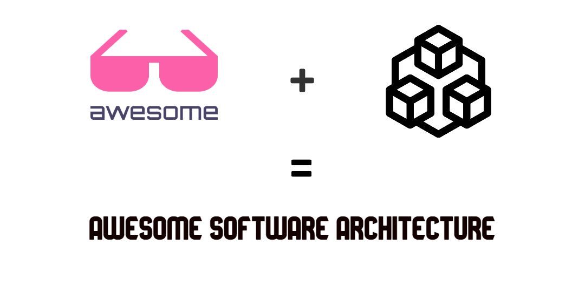

# 🎨 Awesome Software Architecture 

> Curated list of awesome articles and resources to learn and practice about software architecture, patterns and principles. this repository will be updated continuously, keep yourself up to date .

## Support ⭐

Star this repository, And we will be happy together :)

Thanks a bunch for supporting me!
chitecture,designpatterns,modularmonolith
